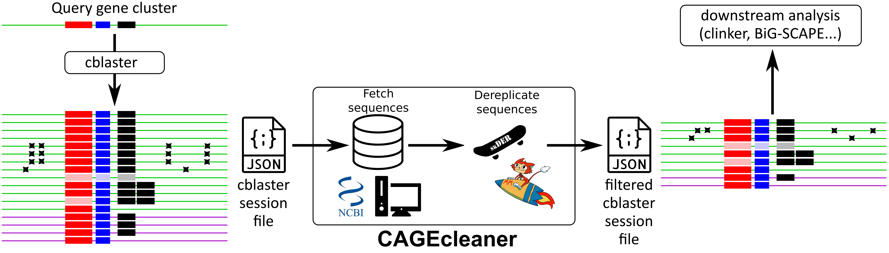

# CAGEcleaner

[](https://bioconda.github.io/recipes/cagecleaner/README.html) [](https://anaconda.org/bioconda/cagecleaner/files)
[](https://doi.org/10.1093/bioinformatics/btaf373)
[](https://doi.org/10.5281/zenodo.14726119)

> [!NOTE]
> `CAGEcleaner` supports all functional `cblaster` modes (remote, local, hmm). We do not recommend using sessions from one of the combi modes.

## Description

`CAGEcleaner` removes genomic redundancy from gene cluster mining hit sets. The redundancy in typical genome mining target databases (e.g. NCBI nr) often propagates into the result set, requiring extensive manual curation before downstream analyses and visualisation can be carried out efficiently.

Starting from a session file or hit table from a `cblaster` or [`CAGECAT`](https://cagecat.bioinformatics.nl/) run, `CAGEcleaner` dereplicates the hits based on a representative sample of the sequence regions that encode these hits (either full genomes or direct genomic neighbourhoods). In addition, `CAGEcleaner` can automatically retain additional hits associated with non-representative sequences if they exhibit significant diversity in gene cluster contents or sequence similarity. Finally, `CAGEcleaner` returns a filtered `cblaster` session file or hit table.

`CAGEcleaner` offers two dereplication approaches.

- **Full genome dereplication *(default option)***: Dereplicates the full genome assemblies of the host organisms using an ANI-based approach via `skDER`, and retains the hits that are encoded by a representative assembly. The more conservative option that also takes the diversity of the host organism into account. Choose this option if you're concerned about preserving host diversity during compression, for example to identify HGT events.
- **Neighbourhood dereplication**: Extracts a genomic region of a predefined length around each hit, clusters all extracted regions by sequence similarity using `MMseqs2`, and retains the hits associated with the representative genomic regions. The more aggressive option that ignores host diversity. Choose this option if losing host diversity is not an issue.

> [!NOTE]
> Although `CAGEcleaner` has been designed to use in conjunction with [`cblaster`](https://github.com/gamcil/cblaster), it supports output from other mining tools by converting your hit table to the `cblaster` hit table format. See the example output for the specifics.



## Installation and more
For installation instructions, usage, explanations and more, head over to the [`CAGEcleaner` wiki](https://github.com/LucoDevro/CAGEcleaner/wiki)!

> [!IMPORTANT]
> `CAGEcleaner` has no direct Windows support anymore. If you have a seemingly successful installation directly on your Windows system, you likely have installed v1.1.0, an old version with known bugs! There are alternative options to run CAGEcleaner on Windows.

## Citations
If you found `CAGEcleaner` useful, please cite our manuscript:

```
De Vrieze, L., Biltjes, M., Lukashevich, S., Tsurumi, K., Masschelein, J. (2025) CAGEcleaner: reducing genomic redundancy in gene cluster mining. Bioinformatics https://doi.org/10.1093/bioinformatics/btaf373
```

`CAGEcleaner` relies heavily on the following tools, so please give these proper credit as well.

```
Salamzade, R., & Kalan, L. R. (2025). skDER and CiDDER: two scalable approaches for microbial genome dereplication. Microbial Genomics, 11(7), https://doi.org/10.1099/mgen.0.001438
Shaw, J., & Yu, Y. W. (2023). Fast and robust metagenomic sequence comparison through sparse chaining with skani. Nature Methods, 20(11), 1661–1665. https://doi.org/10.1038/s41592-023-02018-3
Steinegger, M., & Söding, J. (2017). MMseqs2 enables sensitive protein sequence searching for the analysis of massive data sets. Nature Biotechnology, 35, https://doi.org/10.1038/nbt.3988
```

## License

`CAGEcleaner` is freely available under an MIT license.

Use of the third-party software, libraries or code referred to in the References section above may be governed by separate terms and conditions or license provisions. Your use of the third-party software, libraries or code is subject to any such terms and you should check that you can comply with any applicable restrictions or terms and conditions before use.
